+++
title = 'The Minecraft castle of Jeanneville'
date = '2024-02-15'

showtoc = true

draft = true
+++

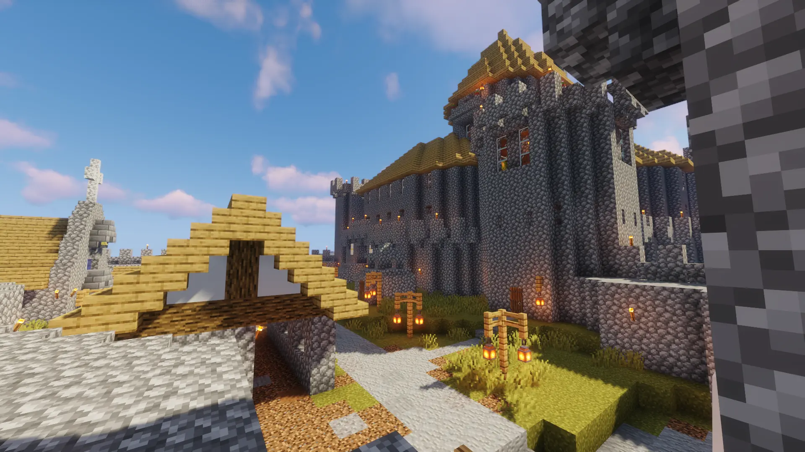

In a Minecraft world in which I used to play there is a village called
*Jeanneville*. Looking over that village and the nearby plains is a
castle, the *castle of Jeanneville*.

It is a medieval castle in the style of 13th century French castles.
Having been built entirely in survival mode, the castle is my Minecraft
base in that world, containing all the things needed to function as
such. That does not, however, compromise realism, which is the primary
goal of the project.

## Brief history

In 2019, I and two friends started playing on a multiplayer survival
world. I began building the castle that year. During 2020 and 2021 I
kept playing on that world from time to time, improving the castle and
building the village.

### The name

The world was named after *Sainte Jeanne d'Arc*
([Saint Joan of Arc](https://en.wikipedia.org/wiki/Joan_of_Arc)),
who is also ideally the Patron Saint of the village and castle. The name
Jeanneville is thus composed of *Jeanne* and the suffix *-ville*.

## The castle's keep

The keep is where the inhabitants of the castle live. The main structure
has four floors, while the tower has an additional 3 floors.

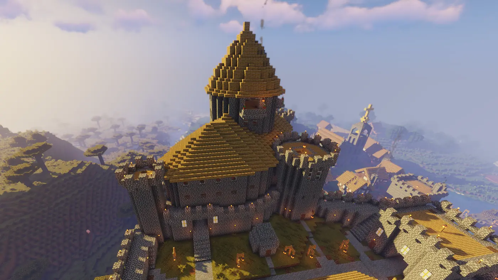

### Storage room

The ground floor is used for storage. It contains an organized system of
chests and barrels used for storing all the resources I need. It is in
here that my precious materials (i.e. diamonds, gold...) are stored.

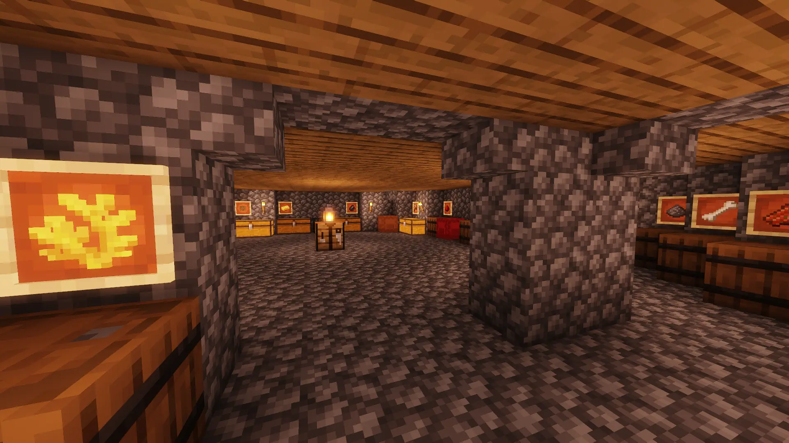

### Great hall and kitchen

In the first floor, the one where the entrance is, there is the *great
hall* and a functioning kitchen. Near the entrance, two spiral
staircases bring to other parts of the castle.

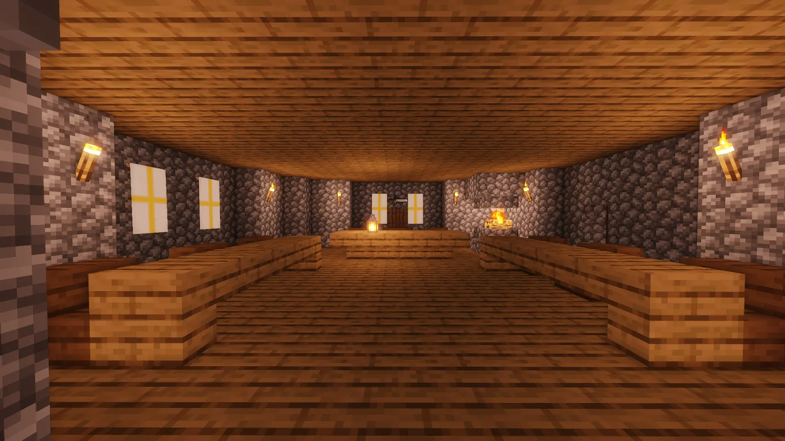

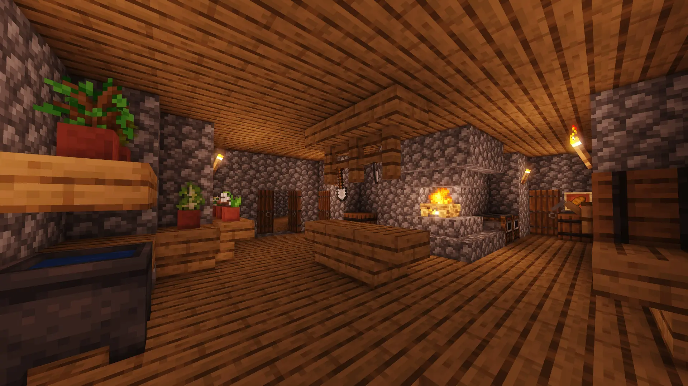

### Garrison quarters

One of those staircases near the entrance brings to the second floor,
used as garrison quarters. The quarters can host up to 20 soldiers, each
equipped with a sword and armor. There is, in the middle, a mess hall in
which soldiers can convene.

Thanks to the **Armor Statues** *data pack*, the item racks really work,
so swords and other items can be taken or deposited by right-clicking on
them.

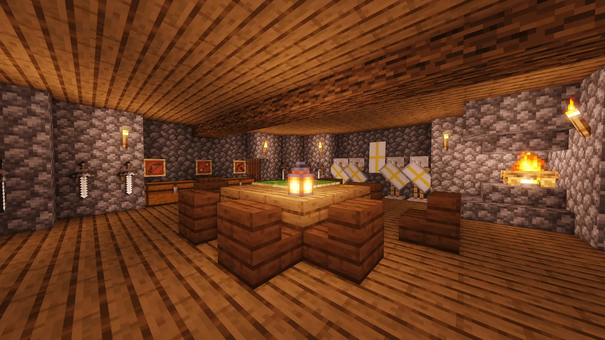

### Private quarters

Beginning at the third floor and continuing all the way to the top of
the tower are the private quarters. These include the master bedroom,
some extra rooms for guests, a room in which to write or read (similar
to an office) and a small library.

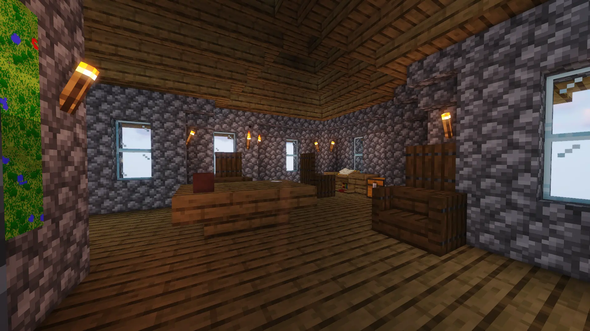

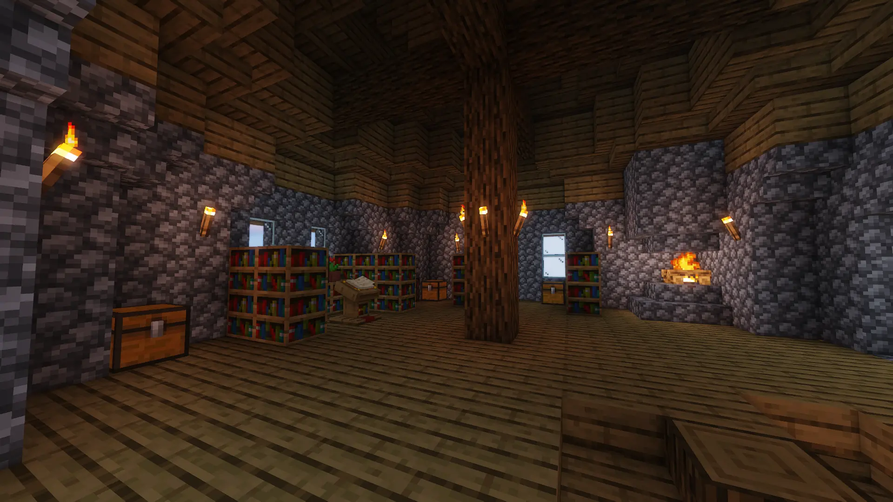

Since the library is at the top of the tower, the room has two
balconies; one looking over the courtyard, the other looking over the
village and the plains.

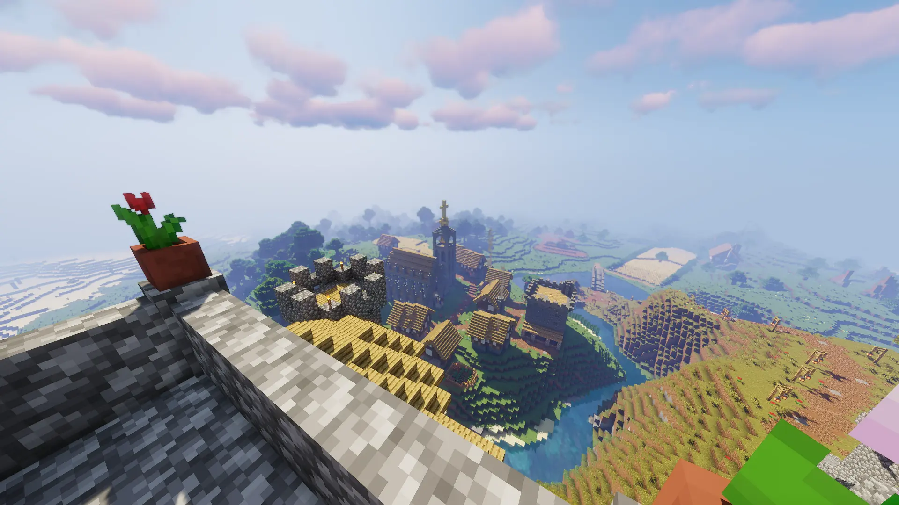

## The castle's courtyard

Between the castle's entrance and the keep is the courtyard. It is
surrounded by the walls and can be entered through the *gatehouse*. The
two main buildings in the courtyard are the chapel and the horse stable.

### Chapel

Found next to the castle's well is a chapel dedicated to Sainte Jeanne
d'Arc. While simple on the outside, it is richly decorated inside,
containing a diamond Cross, a set of golden ciborium and chalice (both
built using the *Armor Statues data pack*) and two images. The first
image is of Saint Joan of Arc, while the second is of the Virgin Mary,
Saint Joan and Saint Thérèse of Lisieux.

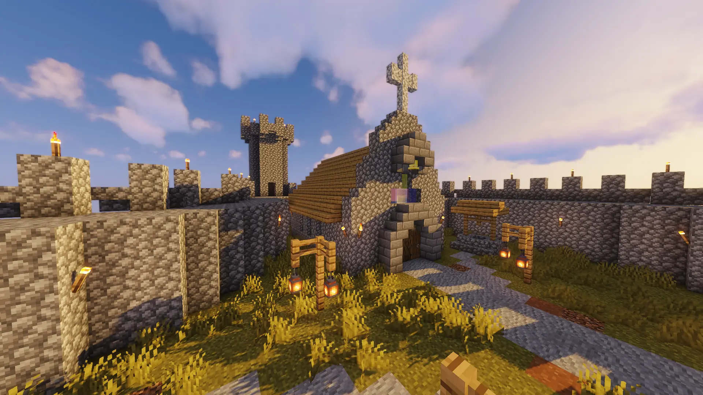

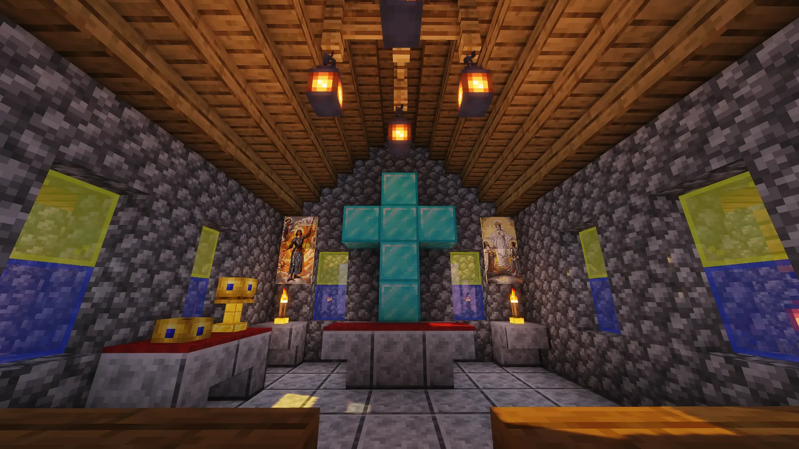

### Horse stable

The other major building in the courtyard is the horse stable, in which
up to three horses can stay.

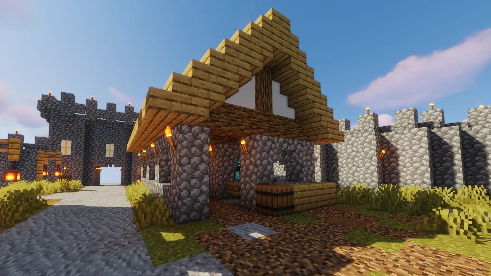

## The castle's walls

The walls defending the castle have two separate levels: the inner level
surrounds the keep, while the outer level surrounds the courtyard.
Through the entire perimeter of the walls are
[machicolations](https://en.wikipedia.org/wiki/Machicolation),
allowing archers standing on top of them to shoot arrows at the
invaders while keeping themselves mostly protected.

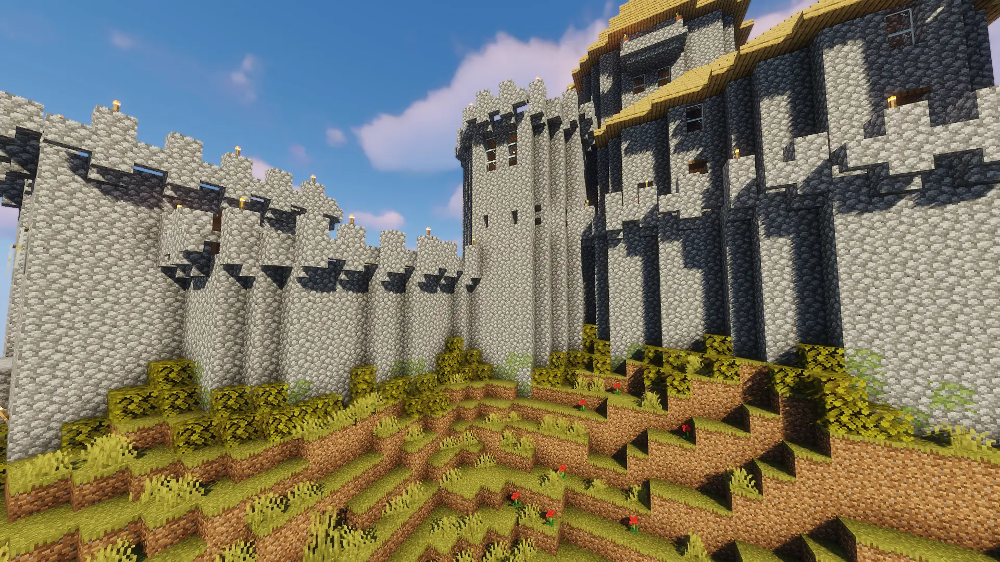

### Gatehouse

The castle of Jeanneville is built on top of a steep hill, with only one
side gentle enough to allow for walking. That side, in which the road to
the village is also built, is defended by the gatehouse. Being the first
line of defence, it controls two sliding gates and has two
[murder holes](https://en.wikipedia.org/wiki/Murder_hole)
in it.

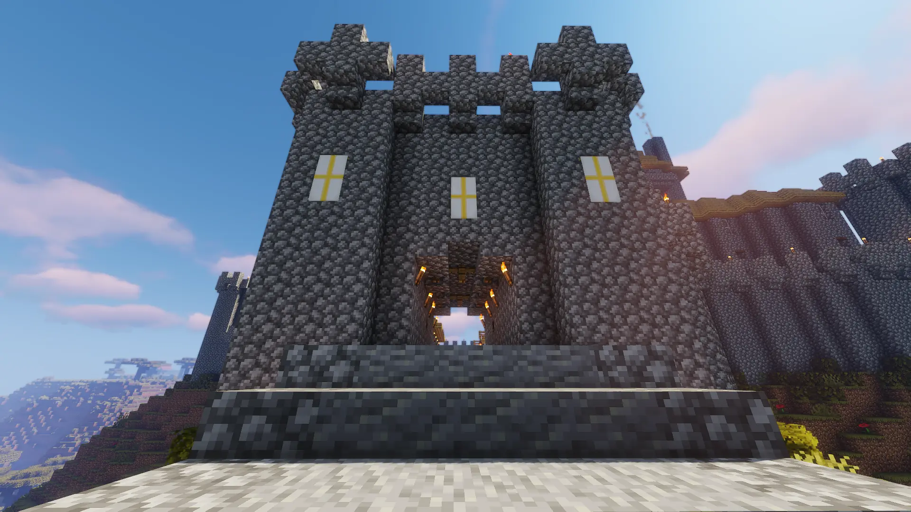

## The village

Built after the castle, the village of Jeanneville is located in the
plains close to it. It has a watchtower, a church and many houses, each
with its own function.

### Watchtower

A rectangular tower with room for six fully equipped soldiers. It has a
mess hall, a storage room and sleeping quarters, as well as a small
horse stable.

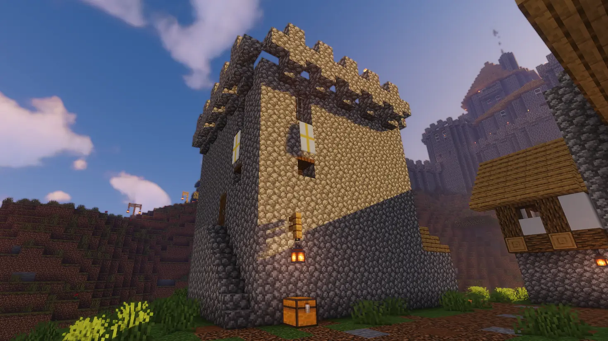

### Church

The church of 'Mater Misericordiae' is built in the
[gothic style](https://en.wikipedia.org/wiki/Gothic_architecture),
with a central *nave* and two *aisles*. On its side there is a bell
tower.

Right by the entrance, there is a statue of Sainte Jeanne d'Arc loosely
inspired by
[this painting](https://commons.wikimedia.org/wiki/File:Scherrer_jeanne_enters_orlean.jpg)
made by
[Jean-Jacques Scherrer](https://en.wikipedia.org/wiki/Jean-Jacques_Scherrer),
built using yet again the *Armor Statues data pack*.

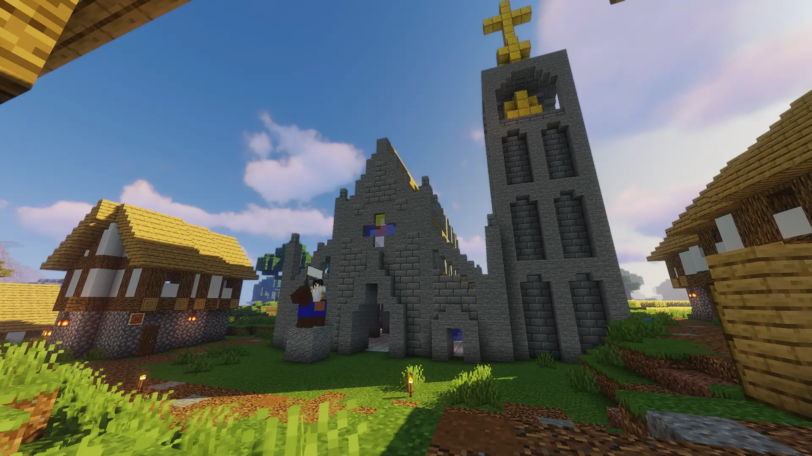

From the inside of the church, still unfinished, it is possible to see
the nave's ceiling composed of
[rib vaults](https://en.wikipedia.org/wiki/Rib_vault),
while exposed wood covers the two aisles.

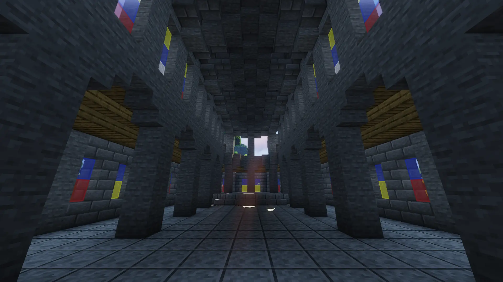

### Houses

In the village and in the nearby area, there are many houses. Each is
unique, both in the way it is built and in its function. For example,
one house is also the blacksmith's workshop, another is a bakery...

Most of the houses share the same style: the ground floor made of stone
and the higher floors
[half-timbered](https://en.wikipedia.org/wiki/Timber_framing)
and
[jettied](https://en.wikipedia.org/wiki/Jettying).

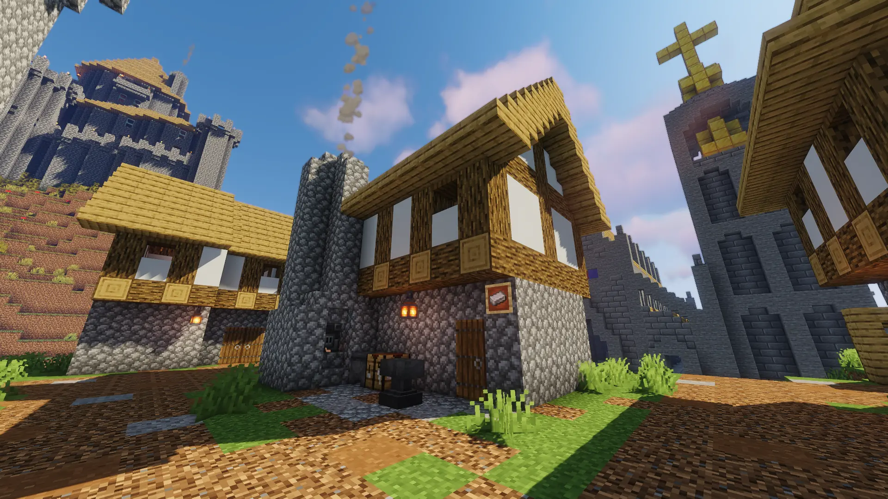

The contents of a house vary greatly. The ground floor may be used
either as a workshop (e.g. blacksmith) or to store things or animals.
The first floor usually has a table and beds. Some houses also have an
attic, used as additional storage or to fit more beds.

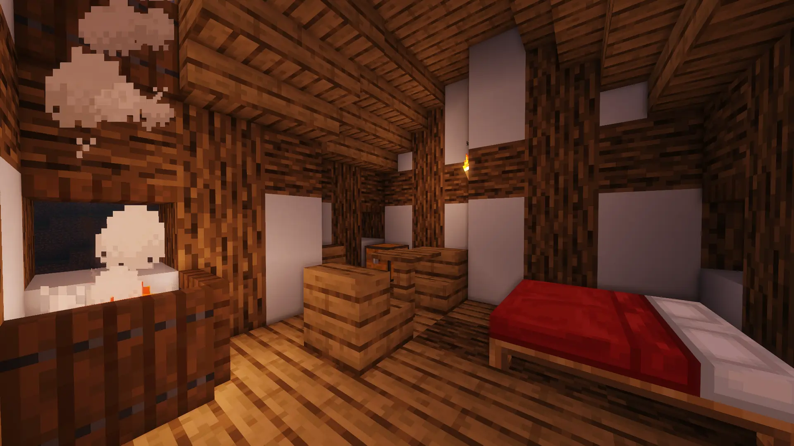

## More screenshots

Here are a few more screenshots of the castle. These were made using the
[Iris Shaders](https://irisshaders.dev/)
mod (for
[Fabric](https://fabricmc.net/))
and
[Sildur's Shaders](https://sildurs-shaders.github.io/).

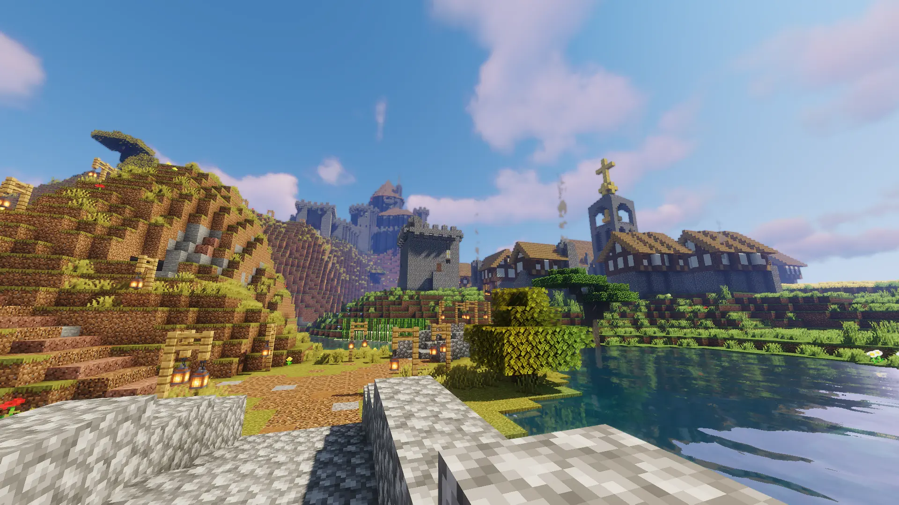

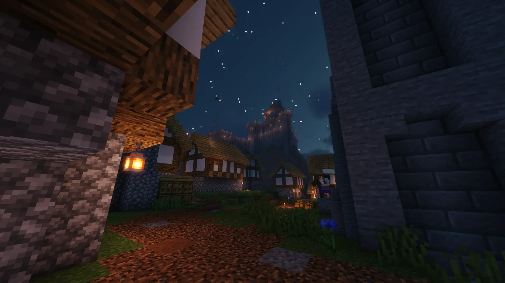

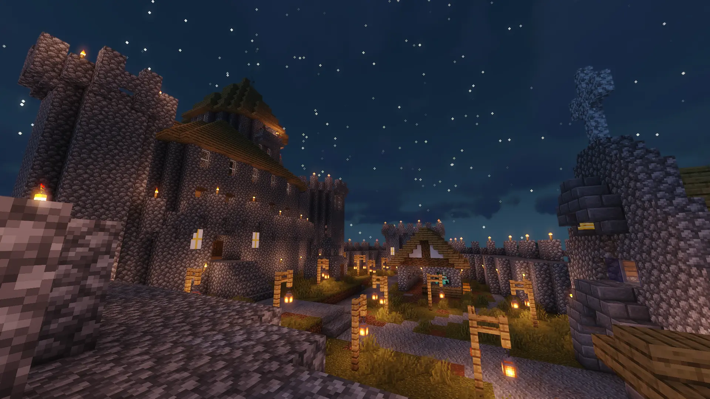

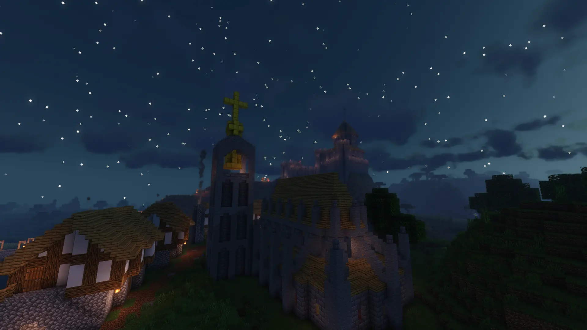

