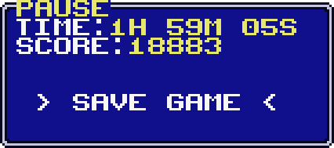

+++
title = 'Minicraft for GBA v1.3'
date = '2024-02-10'
draft = true

showtoc = true
+++

A new version of Minicraft for GBA, my demake of
[Minicraft](https://en.wikipedia.org/wiki/Minicraft)
for the Game Boy Advance, has been released. In this post I will go into
details regarding the changes made.

## Respawning

In previous versions, when the player died, there was no choice but to
go back to the start menu: this meant losing all unsaved progress. This
is how it worked on the original version of Minicraft, but my demake is
meant to bring improvements to make playing Minicraft a better
experience. In version 1.3 the player will instead be able to respawn.

<center>

</center>

The player will always respawn on the surface level at a random
location. Because of this, going back to where you were can take some
time, but it seems like an appropriate incentive to stay alive. It's
also possible to choose whether or not to keep the inventory. By
default, *keep inventory* is enabled, but the option can be disabled in
the start menu.

Implementing this feature was not particularly difficult: first, the
surface level is cleared of all hostile entities (you don't want to be
attacked immediately after respawning!), then a new player entity is
created on that level at a location where he can walk (i.e. can't
respawn inside solid tiles).

## Save file verification

It is possible to lose some data when trying to save the current world
to file. For example, the saving procedure may be halted before being
completed, like when the GBA or emulator running the game is shut down.

<center>

</center>

What usually happens in these situations is that the save data becomes
unusable. Receiving a hint that data corruption might have happened can
hopefully help the player understand what has happened to the save file.

<center>

</center>

### Implementation

The verification uses a simple
[complement checksum](https://en.wikipedia.org/wiki/Checksum#Sum_complement).
Every time a save file is created, all the bytes being written are added
together, so that at the end there is one 32-bit integer, the
*checksum*. The checksum is then stored at the end of the save file.

When the start menu is initialized, the save file is checked before
allowing the player to load it. First, the code looks for a file
signature: 'ZMCE'. If that is found, it goes on and calculates the
checksum by reading all the bytes of the save file and adding them
together.

At the end, if the calculated checksum is equal to the one stored inside
the file, the file will be considered valid. If they are different, the
'Invalid checksum' message shown above will appear. Note that the
warning message does not prevent the player from loading the world.

For those who already have a save file from an older version, don't
worry! The warning message will appear (since there is no checksum
stored in the file) but the world should load without any problem.

## Fixing the in-game clock

In the pause, death and win menus there is a digital clock that keeps
track of how much time a world has been played on.

<center>

</center>

Before version 1.3, the time being displayed was inaccurate. The
function responsible for calculating hours/minutes/seconds and drawing
the clock is `screen_write_time`. This is how the calculation was done
before:
```C
void screen_write_time(u32 time, ...) {
    ...
    u32 seconds = time    / 60;
    u32 minutes = seconds / 60;
    u32 hours   = minutes / 60;
    ...
}
```

The `time` parameter represents the number of times that the world has
received an update. What's wrong with the calculation is that the world
does not update *exactly* 60 times a second.

The world updates at the same frequency at which the GBA's display gets
refreshed, which is not 60 Hz, but about 59.7275 Hz. This must thus be
considered while calculating the `seconds` variable:
```C
static inline u32 ticks_to_seconds(u32 ticks) {
    // refresh time:    280_896    cycles = 4389   * 64 cycles
    // clock frequency: 16_777_216 Hz     = 262144 * 64 Hz
    //
    // framerate = (clock frequency) / (refresh time)
    // time = ticks / framerate
    //      = (ticks * 4389) / 262144
    //      = (ticks * 4389) >> 18

    return (((u64) ticks) * 4389) >> 18;
}

void screen_write_time(u32 ticks, ...) {
    ...
    u32 seconds = ticks_to_seconds(ticks);
    u32 minutes = seconds / 60;
    u32 hours   = minutes / 60;
    ...
}
```

Here's a table showing the time calculated with both the previous and
the updated formula:

<center>

| Game ticks | Old formula | New formula |
| ---------: | ----------: | ----------: |
| 600        |        10s  |        10s  |
| 10000      |    02m 46s  |    02m 47s  |
| 216000     | 1h 00m 00s  | 1h 00m 16s  |
| 1000000    | 4h 37m 46s  | 4h 39m 02s  |

</center>

## Optimizing entity sorting

As in many 2D top-down video games, in Minicraft things that are closer
to the player's viewpoint are drawn on top of things that are further
away. In particular, entities (the player, items on the ground, zombies
and slimes...) need to be sorted before being drawn.

Here's an example showing both the case in which entities are sorted
(left) and the case in which they are not (right):

<center>

</center>

Previously, the sorting algorithm being used was
[Quicksort](https://en.wikipedia.org/wiki/Quicksort).
However, after considering that the y values of visible entities can
always be contained inside a range of fixed size (176 possible values),
using the
[Counting sort](https://en.wikipedia.org/wiki/Counting_sort)
algorithm becomes possible.

The implementation of Quicksort being used was recursive, while the
implementation of Counting sort is iterative. This means that there is
no function call overhead, making the sorting operation even quicker.

## Conclusion

I hope that the changes made with this version will improve the
experience of the players. I believe that being able to respawn without
losing the inventory will be particularly appreciated, since it can be
pretty annoying losing many minutes of playtime due to a single mistake.

Any feedback is appreciated. If you have questions about how other
aspects of the game were implemented, a suggestion to make or
(especially) bug reports,
[contact me](/contact)
or
[open an issue](https://github.com/Vulcalien/minicraft-gba/issues/)
on GitHub.

---

View on GitHub:
[click here](https://github.com/vulcalien/minicraft-gba)\
View on itch.io:
[click here](https://vulcalien.itch.io/minicraft-for-gba)\
Download latest version:
[click here](https://github.com/Vulcalien/minicraft-gba/releases/latest)
