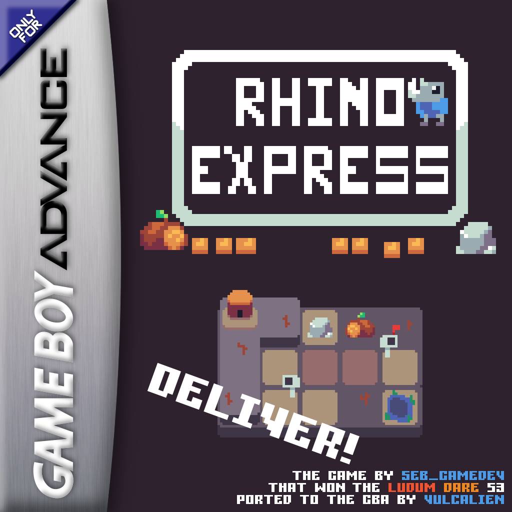
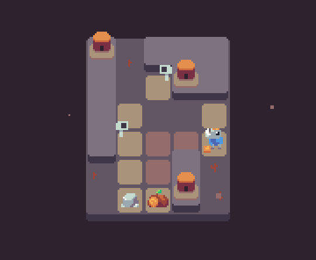
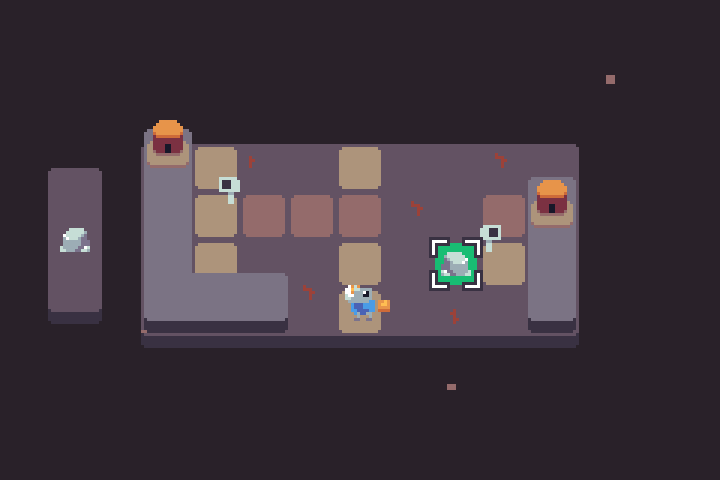

+++
title = 'Rhino Express for GBA'
date = '2025-01-30'

showtoc = true
+++

More than two years after the release of *Minicraft for GBA*, I am now
releasing another demake for Game Boy Advance: *Rhino Express for GBA*.

## Rhino Express
*Rhino Express* is a puzzle game in which the player helps a Rhino make
deliveries, trying to avoid dangerous pits and using obstacles to its
advantage. Made in just 48 hours by *Seb_gamedev*, the game won first
place of the *Ludum Dare 53* competition and was released as a
[browser game](https://seb-gamedev.itch.io/rhino-express).

## GBA port of Rhino Express

### Why I ported it
I like working on the GBA for a few reasons:
- Widespread emulation: thanks to emulators, the games I port can be
  played on a great variety of devices.
- Consistent experience: the console's specifications are fixed and will
  never change, unlike other gaming platforms like computers.
- Technical challenge: the GBA is quite limited in many ways, forcing
  the programmer to be efficient with CPU and memory usage, and having
  to interact with the hardware directly without an operating system.

*Rhino Express*, a 2D game with pixel-art graphics, was a great
candidate for a GBA demake, matching the console's capabilities and
*retro* feeling.

### Differences
Because of the GBA's differences and limits, I had to change or adjust a
few things when porting the game, such as replacing mouse controls with
a keypad-based cursor and moving UI elements to match the different
aspect ratio. There is also a noticeable loss in audio quality, caused
by the inferior GBA sound system, but I find that it adds to the *retro*
feeling.

## Conclusion
For those of you that like GBA games, now you have another one to try
out! See the links below to download the game. If you have any
questions, [contact me](/contact).
For bug reports or suggestions about this demake,
[open an issue](https://github.com/Vulcalien/rhino-express-gba/issues)
on GitHub.

---

Download:
[click here](https://github.com/Vulcalien/rhino-express-gba/releases/latest)\
Source code and instructions on how to play:
[click here](https://github.com/Vulcalien/rhino-express-gba)
